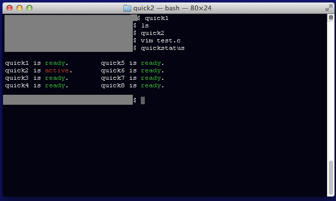
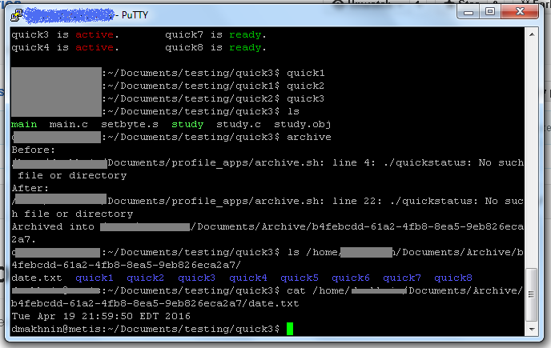
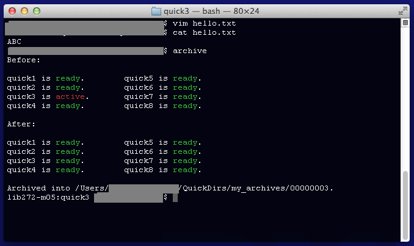

## Table of Contents

* [Introduction](#intro)
* [Features](#features)
* [Installation](#install)
* [Removal](#remove)

## <a name="intro">Introduction</a>

> QuickDirectories is a simple way of managing programming workspace.

## <a name="features">Features</a>

QuickDirectories has many core apps, and capacity to extend and modify.

<a name="core-apps">Core Apps</a>

* [quickstatus](#quickstatus)
* [archive](#archive)
* [...](#)
* [...](#)
* [...](#)

### quick1..quick8
use these commands to quickly jump between the 8 directories. 

### quickstatus

QuickDirectories gives you a special directory called tests which contains 8 folders named 

* quick1
* quick2
* quick3
* quick4
* quick5
* quick6
* quick7
* quick8

I decided that 8 folders is one more thing than the number of things a human can remember, and at that point, you <br />
may as well make a new subdirectory, or [archive](#archive) what you have.

Screenshots:

  





### archive

QuickDirectories has the ability to archive your workspace's 8 test directories into an archive directory <br />
that contains a file named date.txt.

It is up to you to rename the archive to something meaningful by typing "@qd-archives", and editing the archive name.

It is worth noting that the archives are created using UUIDs, which means it is possible for them to collide, but <br />
the odds of that happening are low beyond any number you can possibly write out on a piece of paper, <br />
so for the meantime, be aware of that risk if you are not renaming archives regularly.

Screenshots:




> NOTE: the error was that it had a bug in showing quickstatus, no directories were harmed in the process.


## <a name="install">Installation</a>

First of all, you download this repository.(Manually or by using `git clone https://github.com/CodeDmitry/QuickDirectories`).

Go to QuickDirectories directory you downloaded.

Go to bin directory.

Then you run ./profile to let you know whether your filesystem structure is compatible with QuickDirectories. <br />
This step will warn you if any of your directories overlap with directories the the configuration script will try to create.

After running the profiler, run the configuration script by typing ./configure and the script will set up <br />
all the directories, and put all the files in the right places.

Modify your bash profile to run the setup script by adding the following lines(see note below for details):

```
user=`id -u -n`
source $HOME/QuickDirs/apps/startup/min-setup.sh
source $HOME/QuickDirs/apps/startup/core-app-setup.sh
source $HOME/QuickDirs/apps/startup/my-app-setup.sh
```

**Note**: profile configuration file is normally ~/.profile or ~/.bashrc but you can google where yours is depending on what system you are using(Mac, Ubuntu, MinGW, etc)

Restart your shell and QuickDirectories should be installed.

## <a name="remove">Removal</a>
To remove/uninstall QuickDirectories, go to the bin directory of this project and run `./configure clean`

