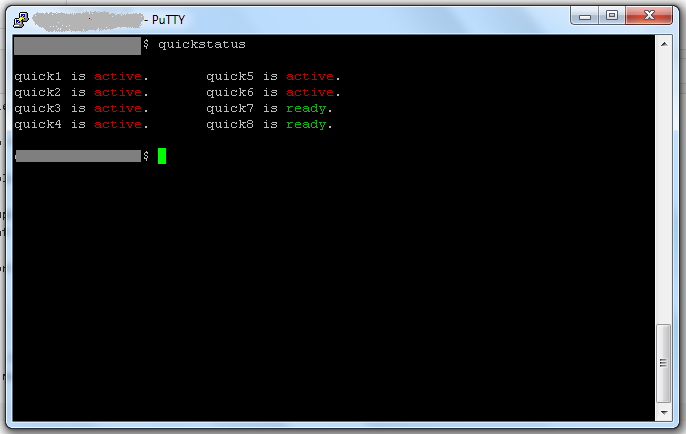

## Table of Contents

* [Introduction](#intro)
* [Features](#features)
* [Shortcuts](#shortcuts)
* [Installation](#install)
* [Removal](#remove)

## <a name="intro">Introduction</a>

QuickDirectories is a collection of tools that makes it easy to hop between 8 projects or workspaces you are working on. It creates 8 directories, quick1, quick2, ... quick8 that can easily be accessed by typing their names.

The goal of QuickDirectories is make it as easy as possible to make many small spike projects, which are crucical for learning new programming languages, checking whether features you expect to work a specific way work the way you expect, and more.

The common use case is to pick a favorite quickdir(eq quick4), then creating a directory with `mkdir`, working on that directory, then after
many directories are made, you can use another quickdir to make more projects. Once the quickdirs are full, you can type "archive"
to have the contents of all archives be moved to location specified by `$QD_ARCHIVES` variable, which can be visited by simply typing
`@qd_archives`. Archives supports multiple archives and does not risk collisions. It is up to you to figure out how to manage archives,
I have not figured that out myself yet, but I suggest putting them into a 7zip archive as it will save space and make the archive faster
to transfer to another disk(as file per file transfer is slow).

It is written in Bash and Perl to ensure maximal portability; It has been tested to work successfully on MinGW, all Linux distributions,
and Unix-likes, except Termux.

## <a name="features">Features</a>

QuickDirectories has many core apps, and is extensible through modifying `my-app-setup.sh` provided.

<a name="core-apps">Core Apps</a>

* [quickstatus](#quickstatus) 
* [archive](#archive)
* [...](#)
* [...](#)
* [...](#)

### quick1..quick8
use these commands to quickly jump between the 8 directories. 

### quickstatus

QuickDirectories gives you a special directory called tests which contains 8 folders named 

* quick1
* quick2
* quick3
* quick4
* quick5
* quick6
* quick7
* quick8

I decided that 8 folders is one more thing than the number of things a human can remember, and at that point, you <br />
may as well make a new subdirectory, or [archive](#archive) what you have.

Screenshots:

  




### archive

QuickDirectories has the ability to archive your workspace's 8 test directories into an archive directory <br />
that contains a file named date.txt. To figure out where the archive directory is, use  the command `echo $QD_ARCHIVES`, or to
instantly jump to the archive directory, type `@qd-archives` which are configured as aliases by min-setup.sh in a `$QD_APPS` directory
(visit by typing `@qd-apps`) in the core directory. 

It is up to you to rename the archive to something meaningful by typing "@qd-archives", and editing the archive name(Which is initially a number generated
specifically not to conflict with the other archives). At time of writing, I reccomend compressing your archived directory with 7zip, to avoid
future issues with having to move many small files, which is very slow).

It is worth noting that the archives are created using UUIDs, which means it is possible for them to collide, but <br />
the odds of that happening are low beyond any number you can possibly write out on a piece of paper, <br />
so for the meantime, be aware of that risk if you are not renaming archives regularly.

Screenshots:


> NOTE: the error was that it had a bug in showing quickstatus, no directories were harmed in the process.


## <a name="shortcuts">Shortcuts</a>
QuickDirectories introduces additional shortcuts to your shell:

@qd-tests: takes you to the directory containing quick1-quick8 directories.<br />
@qd-archives: takes you to the directory containins archives(to store your quick1..quick8 directories, type `archive`).<br />
@qd-home: sets your current directory to quickdirs home. <br />
@qd-apps: sets your current directory to quickdirs apps directory. <br />
the above also have a hard path variable for each of them, such as $QD_QUICK1..$QD_QUICK8, $QD_ARCHIVES, $QD_TESTS, $QD_HOME, $QD_APPS, and $QD_TESTS.

## <a name="install">Installation</a>

First of all, you download this repository.(Manually or by using `git clone https://github.com/CodeDmitry/QuickDirectories`).

Go to QuickDirectories directory you downloaded.

Go to bin directory.

Then you run ./profile to let you know whether your filesystem structure is compatible with QuickDirectories. <br />
This step will warn you if any of your directories overlap with directories the the configuration script will try to create.

After running the profiler, run the configuration script by typing ./configure and the script will set up <br />
all the directories, and put all the files in the right places.

Modify your bash profile to run the setup script by adding the following lines(see note below for details):

```
user=`id -u -n`
source $HOME/QuickDirs/apps/startup/min-setup.sh
source $HOME/QuickDirs/apps/startup/core-app-setup.sh
source $HOME/QuickDirs/apps/startup/my-app-setup.sh
```

**Note**: profile configuration file is normally ~/.profile or ~/.bashrc but you can google where yours is depending on what system you are using(Mac, Ubuntu, MinGW, etc)

Restart your shell and QuickDirectories should be installed.

## <a name="remove">Removal</a>
To remove/uninstall QuickDirectories, go to the bin directory of this project and run `./configure clean`

